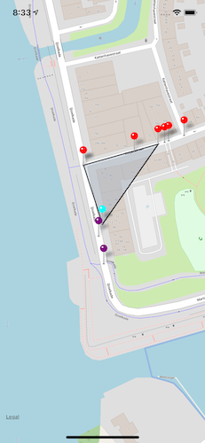

# LaunchControl
This project is a react native project that aims to rate the actions taken when nearing a intersection.

## Features
- current location (blue)
- determines current road of user(purple markers)
- closest right road (red markers)

## Preview

## Demo

## Tools
- React native
- [Overpass API](http://overpass-api.de)
- lot's of maths